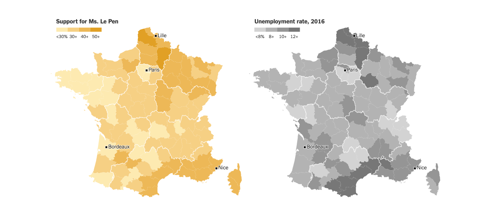
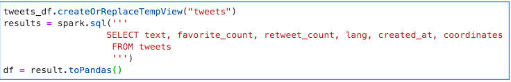
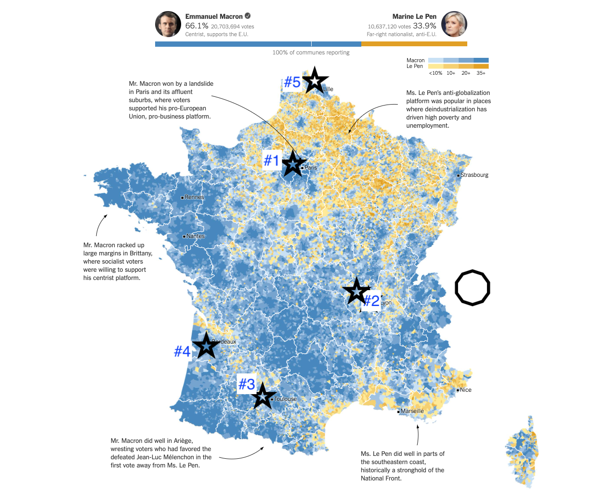
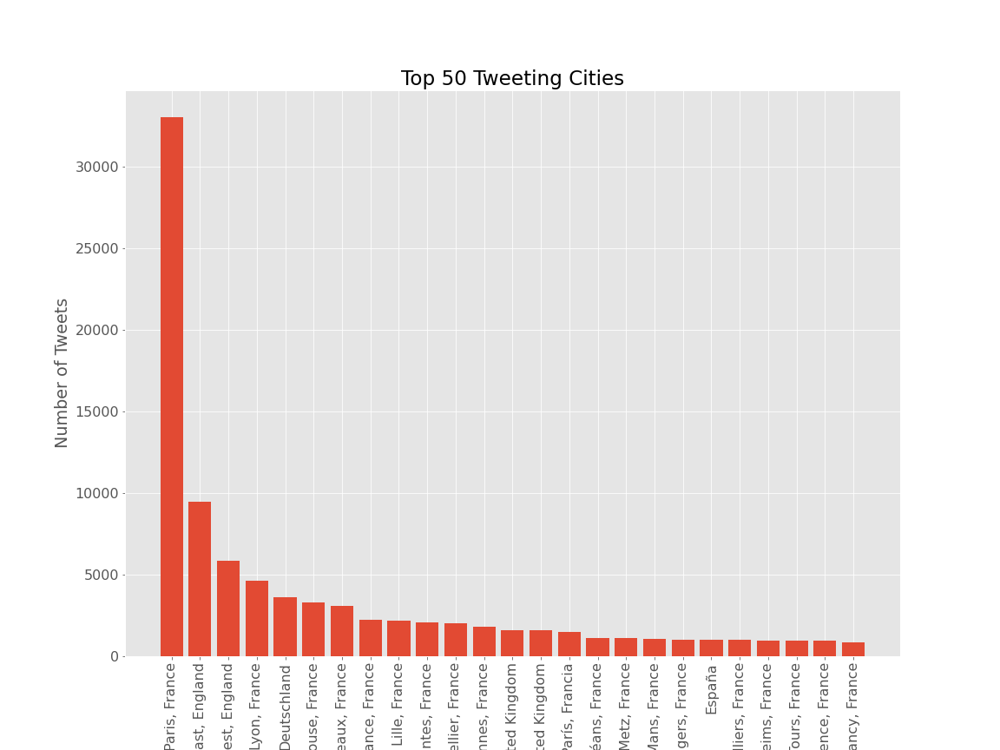
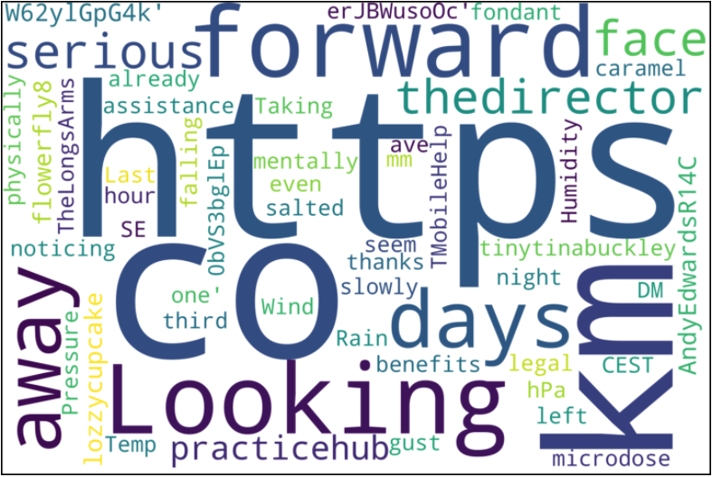

# Spark Case Study
------------------------------------------------------
## Background and Goal
The 2017 Presidential Election in France pitted Emmanuel Macron against Marine Le Pen against each other in a fight for the heart of France and it's relationship with the EU. Similar to other recent election in Europe and around the world, one of the foundational arguments in this election centered around the larger question of globalism (Macron) v. nationalism (Le Pen). While our data set contains only tweets related to the election, we also wanted to do some digging into the outcome of the election, and how France's voters casted their votes. 

The following graphs were taken from [this](https://www.nytimes.com/interactive/2017/05/07/world/europe/france-election-results-maps.html?mtrref=www.google.com&assetType=REGIWALL) New York Times article, "How France Voted", written by GREGOR AISCH, MATTHEW BLOCH, K.K. REBECCA LAI and BENOÎT MORENNE in 2017. We felt these images, and the article itself, did a great job of summarizing geographic differences for the candidates' supporters.

## Our data
This data is a set of tweets generated from the twitter API during the 2017 French election of Emmanuel Macron and Marine Le pen. The data is a line delimited file (747 MB) consisting of each attribute surrounding a single tweet.

## Cleaning Data and EDA

Out of a mass of attributes we chose to narrow down to only a few important columns including text, favortie count, retweet count, language, created at, and coordinates of the tweet. We chose these columns in particular to focus on because our goals were as follows:

* Geographic distribution of tweeters
* Was there a common theme among this set of tweets?
* Most active tweeters around the election 
* Most influential tweeters around the election
* Were the most active tweeters also influential?

--------------------------------------------------
## Geographic Distribution
In order to look at geographic distrubtion, we parsed the 'place' string in the data set to extract the location from which the tweet was sent. If the location did not have any city identifiers within France, they were filtered out for the purposes of this graph so that we could gleam a bit more information from this exercise. While most of the locations were indeed French cities, we were suprised to find that a handful out of the top 25 locations were outside of France. The below bar chart shows the top 25 locations from which tweets from this data set were sent.

We were then curious as to how these cities compared with the geographic distribution of voter results that we looked at earlier, so we overlaid the top five french cities from which people were tweeting about the election on the image below.

--------------------------------------------------

## Word Cloud 

A very ugly world cloud

-------------------------------

## Most Active Tweeters

-------------------------------

## Tweeters with the Most Influence